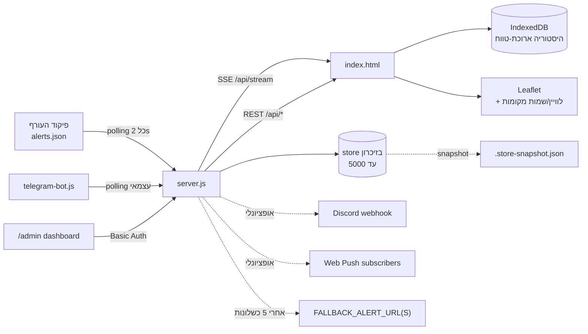

# AGENTS.md

מדריך עבודה בפרויקט עבור Codex. הקובץ נטען אוטומטית כשנפתח השיח בתיקייה הזו.

## מה הפרויקט

**צפיר** (Tzafir; חבילת npm: `tzafir`, לשעבר `israel-alert-map`, v1.6.1) — שרת Node.js + קליינט HTML עצמאי שמציג בזמן אמת את אזעקות פיקוד העורף על מפת Leaflet. תלות בליבה: אפס (רק `node` ≥ 18). תלויות אופציונליות: `web-push`, `node-telegram-bot-api`. שם ה-repo ב-GitHub נשאר `RedAlert` במכוון (המיתוג שונה, ה-repo לא שונה).

מקור הנתונים: `https://www.oref.org.il/WarningMessages/alert/alerts.json` (polling כל 2 שניות). אין מפתחות, אין הרשמה.

## ארכיטקטורה — תרשים



## מבנה הקבצים

**קוד האפליקציה עצמו שטוח לחלוטין** (אין `src/`, אין תיקיות משנה ל-`server.js`/`index.html`/`lib.js` — זו החלטה מכוונת). יש תיקיות משנה ל**עזר** בלבד: `test/` (טסטים), `scripts/` (כלי release), `docs/` (openapi.yaml + screenshot), `release-banners/` (נכסים):

| קובץ | תפקיד |
|---|---|
| [server.js](server.js) | שרת HTTP יחיד — proxy ל-OREF, SSE, API, PWA assets, admin dashboard, Web Push, fallback, health webhook, store snapshot. **בנוי כקובץ אחד עם שורות צפופות מאוד** (one-liners מכוונים). |
| [index.html](index.html) | קליינט מונוליטי — HTML + CSS + JS באותו קובץ. כל המפה, ה-UI, IndexedDB, audio, TTS. **טוען את [lib.js](lib.js) באופן סינכרוני** (`<script src="/lib.js">`) לפני הסקריפט הפנימי. |
| [lib.js](lib.js) | **מקור-אמת יחיד** ל-data סטטי (`CITIES`, `LN`, `TM`, `RS`, `SHELTERS_DEFAULT`) ופונקציות פניניות (`escapeHtml`, `formatShelter`, `shelterClass`, `distanceKm`, `isDND`, `normalizeCity`, `fuzzyMatch`). UMD — עובד גם כ-`<script>` בדפדפן (גלובל `AlertLib`) וגם כ-`require('./lib.js')` ב-Node. הקליינט עוטף בשמות קצרים (`X`, `C`, `findC`...), הטסטים מייבאים ישירות. |
| [test/unit.js](test/unit.js) | בדיקות יחידה ל-`lib.js` דרך `node:test`. ללא תלויות. |
| [test/integration.js](test/integration.js) | בדיקת אינטגרציה ברמת ה-API — מקים mock OREF + spawned server, מאמת אזעקה זורמת ל-`/api/alerts` + SSE + `/api/health`. ללא דפדפן. |
| [test/e2e.js](test/e2e.js) | E2E בדפדפן אמיתי (Playwright, `channel:'chrome'` — משתמש ב-Chrome המותקן מקומית, בלי הורדת דפדפן bundled). מריץ spawned server + בודק רגרסיות UI אמיתיות שנתפסו בעבר (פוקוס בחיפוש, שימור טאב, רוחב ניווט מובייל, תוויות מקלטים, צבעי option במצב כהה, תוויות טאב חסרות, קריסת טאב היסטוריה) — כל טסט מקושר לבאג ספציפי מה-CHANGELOG. `playwright` הוא `devDependency` בלבד. |
| [telegram-bot.js](telegram-bot.js) | בוט עצמאי — polling ל-`/api/alerts` ושליחה לערוץ טלגרם. |
| [Dockerfile](Dockerfile) + [docker-compose.yml](docker-compose.yml) | בנייה ל-`node:20-alpine` עם healthcheck. |
| [package.json](package.json) | scripts בלבד; ללא `dependencies` רגילים, רק `optionalDependencies`. |

קבצי runtime שנוצרים אוטומטית (ב-`.gitignore`):
- `logs/alerts.log` — לוג אזעקות עם רוטציה (10MB × 5 קבצים)
- `logs/client-errors.log` — שגיאות JS מהקליינט (`POST /api/client-error`), אותה מדיניות רוטציה, קובץ נפרד כדי שהתקפי שגיאות מקליינטים לא ידחקו את לוג האזעקות
- `logs/admin-audit.log` — כל ניסיון אימות ל-`/admin`/`/metrics` (הצלחה/כישלון + IP), אותה מדיניות רוטציה
- `.vapid-keys.json` — מפתחות VAPID ל-Web Push (נוצרים בהפעלה ראשונה)
- `.push-subs.json` — הרשמות Push
- `.store-snapshot.json` — snapshot של היסטוריית האזעקות; נטען בהפעלה (כ-history בלבד, לא active) כדי לשרוד restart/redeploy

## פקודות הפעלה

```bash
node server.js              # מפעיל את השרת על פורט 3000
node test/unit.js           # 90+ בדיקות (כולל smoke test לשרת)
node test/integration.js    # אינטגרציה ברמת API — mock OREF → server → SSE
node test/e2e.js            # E2E בדפדפן אמיתי — דורש Chrome/Edge מקומי + playwright (devDependency)
node telegram-bot.js        # בוט טלגרם (דורש משתני סביבה)
npm install                 # התקנת web-push + telegram-bot-api (אופציונלי)
docker-compose up -d        # פריסה ב-Docker

npm start                   # = node server.js
npm test                    # = node test/unit.js
npm run test:integration    # = node test/integration.js
npm run test:e2e            # = node test/e2e.js
npm run test:all            # הריצה של שלושתם ברצף
npm run telegram            # = node telegram-bot.js
npm run docker:build        # docker build -t alertmap .
npm run docker:run          # docker run -p 3000:3000 ...
```

אין `npm run lint`, `npm run typecheck`, `npm run format` — הפרויקט ללא toolchain.

## משתני סביבה

| משתנה | ברירת מחדל | הערה |
|---|---|---|
| `PORT` | `3000` | פורט השרת |
| `ADMIN_USER` / `ADMIN_PASS` | `admin` / *(אקראי)* | אם `ADMIN_PASS` לא מוגדרת — מוגרלת בהפעלה ומודפסת ללוג פעם אחת (משתנה בכל restart עד הגדרת ערך קבוע). |
| `ADMIN_TOTP_SECRET` | (ריק) | סוד TOTP (base32) — כשמוגדר, הפעלת 2FA על `/admin`+`/metrics`: סיסמת ה-Basic Auth הופכת ל-`ADMIN_PASS` + קוד בן 6 ספרות מאפליקציית authenticator. ה-URI ל-QR מודפס ללוג בהפעלה. ללא תלות npm — `crypto` HMAC-SHA1 מובנה. |
| `FALLBACK_ALERT_URL` | (ריק) | URL חלופי שמופעל אחרי 5 כשלונות OREF |
| `HEALTH_WEBHOOK` | (ריק) | URL ל-POST כשהשרת degraded/recovered |
| `DISCORD_WEBHOOK_URL` | (ריק) | Webhook של ערוץ Discord (Channel Settings → Integrations → Webhooks) — שולח embed לכל batch אזעקות אמיתי חדש מ-`pollAlerts()`. אין SDK, POST רגיל דרך `https`. |
| `TELEGRAM_TOKEN` / `TELEGRAM_CHANNEL` | (ריק) | לבוט בלבד |
| `OREF_URL_OVERRIDE` / `OREF_HIST_OVERRIDE` | (ריק) | החלף את URL של OREF (לטסטים בלבד; `test/integration.js` משתמש בזה) |
| `SHELTERS_URL` | (ריק) | JSON חיצוני של מקלטים אמיתיים (`[{lat,lng,n}]`); הקליינט מחליף את ~35 הדוגמאות ה-illustrative אם נמצא. **אין מאגר CKAN פתוח של מקלטים ב-data.gov.il** (נבדק — 0 תוצאות); ה-default הוא נקודות מרכז-עיר גסות ומסומנות "לדוגמה", לא כתובות מאומתות. **חריגים: תל אביב-יפו, ירושלים, חיפה** — כשלא מוגדר `SHELTERS_URL`, הקליינט שולף אוטומטית נתונים אמיתיים משכבות ה-GIS העירוניות הפתוחות של שלוש הערים (`GET /api/shelters/{tel-aviv,jerusalem,haifa}`, כל אחת proxy מטומן בשרת עם TTL 24h — ראה `makeShelterFetcher()`/`getTelAvivShelters()`/`getJerusalemShelters()`/`getHaifaShelters()` ב-server.js) ומחליף איתם את הדוגמאות הכלליות של אותן ערים; `loadExternalShelters()` ב-index.html מנקה גם כפילויות קואורדינטה מדויקת (חלק מהמקורות העירוניים חוזרים על אותו מבנה פעמיים). שאר הערים נשארות illustrative — **באר שבע** יש לה רישום אמיתי ב-ArcGIS Hub (`gis-beer-sheva.opendata.arcgis.com`, ~81 רשומות) אך ה-endpoint בפועל (`opendatagis.br7.org.il`) לא נענה מכאן (כנראה חסום מחוץ לישראל) ולכן לא חובר; **ראשון לציון**/**פתח תקווה** נבדקו ואין להן שכבת GIS פתוחה למקלטים (רק PDF סטטי) |

## ארכיטקטורה — נקודות חיוניות

### שרת ([server.js](server.js))

- **Polling יחיד**: `setInterval(pollAlerts, 2000)` מושך את OREF, מחשב hash, מוסיף לרשימה גלובלית (`store`, max 5000), משדר לכל לקוחות ה-SSE. אזעקות מוגדרות "active" למשך 90 שניות ואז מוחלפות ל-history.
- **SSE** ב-`/api/stream`: שולח init אז update בכל שינוי, heartbeat כל 2s.
- **דדופליקציה**: `lastHash` נמחק אחרי 30 שניות — אזעקה זהה תוך חצי דקה נחשבת חוזרת.
- **Fallback**: אחרי 5 כשלונות רצופים, עובר ל-`FALLBACK_ALERT_URL`. בודק חזרה ל-OREF כל 60s.
- **Web Push**: רק אם `web-push` הותקן. VAPID keys נשמרים ב-`.vapid-keys.json` ונוצרים אוטומטית. הקליינט נרשם דרך `wpSub()` ושולח `subscription`+`favs`+`dnd` ל-`/api/push/subscribe`; השרת מסנן פושים לפי עיר מועדפת ושולח `silent` בשעות שקט.
- **Rate limit**: 120 בקשות לדקה לכל IP. בקליפינג ב-`setInterval` כל 5 דקות.
- **Gzip**: רק לתוכן > 1KB ו-MIME types מסוימים.
- **HTML cache**: `getHtml()` קורא את `index.html` ושומר במזיכרון לפי mtime — שינוי בקובץ נתפס בלי restart.
- **Admin dashboard**: `/admin` עם Basic auth, פולל את `/api/admin/metrics` כל 5s.
- **Security headers**: רק לתגובת HTML. JSON endpoints לא מקבלים `X-Content-Type-Options` וכו'.

### קליינט ([index.html](index.html))

- **קוד JS דחוס ידנית**: שמות משתנים בני אות אחת, פונקציות בני 2-3 אותיות (`X`=escape, `t`=translate, `C`=cities, `TM`=type map, `RS`=region shelter, `SHL`=shelters list). זה לא מינופיקציה אוטומטית — לעריכה צריך לקרוא כל שורה בעיון.
- **State גלובלי**: `hist`, `act` (Map), `mrk` (Map), `known` (Set), `favs`, `flt`, `theme` וכו' — אין framework.
- **Persistence**:
  - `localStorage`: lang, theme, favs, dnd, tts, siren, hc, cls, push.
  - `IndexedDB` (`alertmap` v1, store `alerts`): היסטוריה ארוכת טווח להשוואות (today/yesterday/weekAvg).
- **SSE + fallback polling**: `connectSSE()` + `startPoll()` רץ כל 5s רק אם `sseOK=false`.
- **Cities (`C`)**: dict סטטי של ~55 ערים עם lat/lng, region, shelter time (לא 130+ כמו ב-README).
- **Fuzzy matching (`findC`)**: exact → normalized → substring → word-by-word. תומך ב-"תל אביב - יפו" → "תל אביב".
- **i18n (`LN`)**: 14 שפות — he/en/ar/ru + am (אמהרית) / ti (תיגרינית) / th (תאילנדית) / tl (טאגלוג) / uk (אוקראינית) / fr / es / ro / hi / zh. `t(key)` עם fallback ל-Hebrew; לכל השפות אותו סט מפתחות + LANG_META + TTS_LOCALE (נבדק אוטומטית ב-test/unit.js, describe('i18n completeness')). כיוון RTL/LTR עובר דרך `AlertLib.isRTL(lang)` (he/ar בלבד RTL) — פנינה ב-lib.js, לא לוגיקה inline. ביקור ראשון ללא `?lang=`/localStorage שומר על ניחוש לפי `navigator.languages` (`detectBrowserLang()`) לפני נפילה חזרה לעברית. התרגומים ל-am/ti הם best-effort (שפות low-resource) — מומלץ אימות ע״י דובר native לפני הסתמכות תפעולית. `<select id="langS">` נבנה דינמית ב-JS מ-`AlertLib.LANG_META` (אין יותר עריכת `<option>` ידנית ב-index.html). TTS משתמש בקידומת `ttsPrefix` המתורגמת ובלוקאל מ-`AlertLib.TTS_LOCALE[lang]`. `speak(cities)` מקבל מערך ומדבר קריאה אחת לכל batch — קריאה בלולאה לכל עיר בנפרד תבטל (`speechSynthesis.cancel()`) את הקודמת לפני שנשמעה.
- **תפריטים/טאבים**: `alerts` (ברירת מחדל, כולל שורת חיפוש-עיר עם autocomplete מ-`<datalist id="cityList">` (מאוכלס פעם אחת ב-DOMContentLoaded מ-`citySelOptions()`), בורר "קפוץ ליישוב" (`citySelOptions()`/`jumpToCity()`) וסינון) / `stats` / `history` (טוען את **כל** ההיסטוריה מ-IndexedDB דרך `gDB()`, לא רק את ה-500 שב-`hist` בזיכרון; טווח תאריכים + חיפוש עצמאיים, גם עם `list="cityList"`, כולל replay — `▶ הפעל` טס את המפה כרונולוגית על פני `historyReplayList` שנבנה מחדש בכל render, `setInterval` בקצב קבוע, `stopReplay()` תמיד נקרא כשעוזבים את הטאב/משנים פילטר) / `updates` (מציג את מערך `CHANGES` הסטטי, מראה גם פופאפ "מה חדש" חד-פעמי דרך `checkWhatsNew()` שמשווה `APP_VERSION` ל-`localStorage['alertmap-lastver']`) / `about`. דסקטופ: `.stabs`/`swTab()` — כל `.stab` הוא `display:flex;flex-direction:column` (אייקון ב-`.si` למעלה, תווית מתורגמת `<span data-i18n>` למטה), **בנוסף** ל-`aria-label`+`title`. **⚠️ למה column ולא inline**: עד ל-v1.6.1 רק אזעקות הייתה עם טקסט גלוי (שאר הטאבים היו אייקון בלבד עם title בהובר); כשנוסף טקסט גלוי לכולם בפריסת inline רגילה, המילים הארוכות ("סטטיסטיקה") נשברו לשורה שנייה בעוד מילים קצרות ("אודות") נשארו בשורה אחת — גובה לא אחיד ומראה שבור. פריסת column עם `.si{font-size:13px}` נותנת את אותו גובה בדיוק לכל 5 הטאבים בלי תלות באורך המילה. יש טסט E2E ל-regression הזה. מובייל: `.mn-i`/`mobTab()` (מעתיק את `#sbC` ל-`#mSheet`; טאבים אסינכרוניים כמו history מוחזרים כ-Promise כדי שההעתקה תחכה לרינדור). **`.mn-i` חייב `width:100%` מפורש** — `.mn` הופך ל-`display:flex` במובייל, ולכן `.mn-i` (הילד שלו) הוא flex-item שמתכווץ ל-content-width בלי `width`/`flex` מפורש, מה שדוחס את כל 6 כפתורי הניווט התחתון לפינה אחת ומטשטש את הטקסט (זה בדיוק הבאג שתוקן). כפתורי תרומה (Ko-fi/Buy Me a Coffee/Patreon, מ-`DONATE_LINKS`, דרך `donateMini()`) מופיעים בכל טאב חוץ מ-About (ששם יש את `donateCard()` המלא) + בתחתית מודל ההגדרות. **כל כפתור/אייקון ללא טקסט גלוי (`.mc`, `.hl`, `.stab`) חייב גם `aria-label` וגם `title`** — `aria-label` בלבד לא מציג tooltip בהובר לעכבר. **כל `<select>` חדש חייב גם `select option{background:...;color:...}`** (ראה `.fs option,.ls option`) — דפדפנים לא מיישמים את צבעי ה-select על פופאפ ה-option באופן אוטומטי, ובלי זה טקסט לבן על רקע לבן במצב כהה.
- **מקלטים על המפה** (`tglShl()`): מרקר מציג רק נקודה (`.md`) + `bindPopup()` בלחיצה — **בלי** תווית טקסט קבועה (`.ml`) מעל המרקר. עם מאות מקלטים אמיתיים בעיר אחת (ת"א), תווית קבועה לכל מרקר נמרחת לכתם בלתי קריא בכל זום; ה-popup בלחיצה מספיק. (מרקרי אזעקה ב-`addMrk()` כן משתמשים ב-`.ml` — שם הכמות קטנה מספיק שזה לא בעיה.) הפופאפ (`shelterPopup()`) כולל גם קישורי ניווט (Waze + Google Maps) לקואורדינטת המקלט.
- **⚠️ אילוץ קריטי — רינדור מחדש של טאב לא-פעיל**: `updUI()` (שרץ מ-`schedUI()`/`procSA`/`visibilitychange` וכו') קורא ל-`refreshCurrentTab()` ולא ל-`renderSB()` ישירות — `refreshCurrentTab()` בודק את `currentTab` ומעדכן רק את `#sbC` של הטאב הפעיל בפועל. **לעולם אל תקראו ל-`renderSB()`/`renderHistoryTab()` בלי בדיקת `currentTab` קודם** — קריאה לא-מותנית כותבת על `#sbC` את תוכן האזעקות/היסטוריה גם כשמשתמש צופה בטאב אחר (זה בדיוק הבאג שתוקן: מעבר טאב בדפדפן החזיר את התצוגה לאזעקות במקום להישאר בטאב האחרון).
- **⚠️ אילוץ קריטי — שדות חיפוש חיים (`#fQ`, `#hQ`)**: `renderSB()`/`renderHistoryTab()` מחליפים את כל ה-`innerHTML` של `#sbC`, כולל את שדה החיפוש עצמו. כל שינוי בפונקציות האלה **חייב** לשמר `document.activeElement`/`selectionStart`/`selectionEnd` לפני ה-render ולשחזר אותם (`focus()`+`setSelectionRange()`) אחריו, אחרת כל הקשה במקלדת מוציאה את הפוקוס מהשדה (המשתמש לא יכול להקליד ברצף). `renderHistoryTab()` גם מדלג על ה-skeleton loader כשהטאב כבר מרונדר (רק בטעינה ראשונה), ומגן מפני race condition עם `historySeq`.
- **⚠️ אילוץ קריטי — `sDB()` לא שומר `type`**: רשומות ב-IndexedDB (`sDB()`) שומרות רק `typeKey` (מחרוזת), לא את אובייקט `type` המלא (icon/css/color) ש-`rItem()`/`addMrk()` דורשים. `renderHistoryTab()` משחזר אותו ידנית (`a.type=TM[a.typeKey]||TM.rockets`) אחרי `gDB()` — **זה היה באג אמיתי וארוך-טווח**: לפני התיקון, כל ביקור בטאב היסטוריה עם נתוני IndexedDB אמיתיים קרס על `Cannot read properties of undefined (reading 'icon')` ותקוע על ה-skeleton loader לנצח. אם מוסיפים עוד מקום שקורא רשומות גולמיות מ-`gDB()`/IndexedDB — לבדוק את זה שוב. יש טסט E2E ל-regression הזה (`test/e2e.js`, זורע רשומה ידנית ב-IndexedDB בפורמט המדויק של `sDB()`).
- **מפה**: Leaflet, כל שכבות הבסיס דרך Esri (`server.arcgisonline.com`, ללא מפתח API בשום מצב — hostname אחד ל-CSP `img-src`/SW tile-cache). מצב רגיל (בהיר/כהה): `Canvas/World_{Dark,Light}_Gray_Base` + שכבת שמות/גבולות נפרדת `Canvas/World_{Dark,Light}_Gray_Reference` (`basemapRef`, `pane:'labelsPane'`, תמיד דלוקה — לא ניתנת לכיבוי) — **עד 2026-08 היה זה CartoDB** (`basemaps.cartocdn.com`); הוחלף כי CARTO דרשו מפתח API והתחילו למרוח "API KEY REQUIRED" על כל אריח. **חשוב**: ל-Canvas layers (base+reference) אין כיסוי אמיתי מעבר לזום 16 ברוב האזורים (בניגוד ל-World_Imagery) — `tileOpts()` קובע `maxNativeZoom:16` כדי ש-Leaflet יגדיל (upscale) את האריח האחרון במקום לבקש אריחים לא-קיימים/ריקים. שכבת לוויין חינמית — Esri World Imagery — דרך כפתור 🛰️ ב-`.mc` (`tglSat()`); מעליה אפשר להציג/להסתיר שכבת שמות מקומות נפרדת (`Reference/World_Boundaries_and_Places`, גם היא ב-`labelsPane`) דרך כפתור 🏷️ (`satLblB`/`tglSatLabels()`, מוצג רק כש-`satOn` — זו כן ניתנת לכיבוי, בשונה מ-`basemapRef`).
- **PWA**: SW מקודד בתוך `server.js` (משתנה `SW`), מטמון `red-alert-v17` + מטמון אריחים נפרד `red-alert-tiles-v2` (Leaflet basemap כולל לוויין ושכבת שמות, cache-first). שינוי ל-SW דורש bump של `CN` ב-server.js. **שים לב**: `TILE` הוא מטמון נפרד שה-`activate` handler *לעולם לא* מנקה (כדי ששטחים שכבר נצפו יעבדו אופליין) — אם משנים URL/ספק של אריחים, חובה ל-bump גם את `TILE`, אחרת אריחים ישנים/פגומים נשארים במטמון של משתמשים קיימים לצמיתות. v1.6.1 (מעבר CARTO→Esri) פספס את זה; תוקן ב-v1.6.2.

## איך להוסיף תכונה / לשנות קוד

1. **שינויים בלוגיקת השרת** — `server.js` ערוך ישירות. אין hot reload — `node server.js` מחדש.
2. **שינויים בקליינט** — `index.html` ערוך ישירות. השרת מזהה את שינוי ה-mtime ומגיש את הגרסה החדשה (refresh בדפדפן). זכור ש-Service Worker עלול להגיש cached גרסה — חשוב ל-bump את `CN` (כרגע `red-alert-v17`) ב-`server.js` (משתנה `SW`) כדי להפעיל invalidate, או לפתוח DevTools → Application → Service Workers → Unregister. אם שינית URL/ספק של אריחי מפה — bump גם את `TILE` (כרגע `red-alert-tiles-v2`), אחרת אריחים ישנים נשארים במטמון הנפרד לצמיתות (ה-`activate` handler לא מנקה אותו).
3. **הוספת עיר** — ערוך את `CITIES` ב-[lib.js](lib.js). פורמט: `"שם":{lat:X,lng:Y,r:"אזור",s:זמן_מיגון}`.
4. **הוספת שפה** — הוסף ערך ל-`LN`, ל-`LANG_META` (שם native + דגל) ול-`TTS_LOCALE` (קוד BCP-47) ב-[lib.js](lib.js) — כולל **כל** המפתחות שקיימים ב-`LN.en` (test/unit.js/הקוד לא בודקים זאת אוטומטית, אבל חוסר מפתח נופל חזרה ל-Hebrew בשקט). `<select id="langS">` ב-index.html נבנה אוטומטית מ-`LANG_META` דרך `initLangSelect()` — אין לערוך אותו ידנית.
5. **endpoint חדש** — הוסף `if (p === '/api/...')` ב-`server.js` ל-pipeline הקיים בתוך `http.createServer`. תזכור `track(p, code)` ו-`gz(req, res, body, ct)`.
6. **בדיקות** — הפונקציות הפניניות חיות ב-[lib.js](lib.js) (מקור-אמת יחיד). הקליינט עוטף בשמות קצרים, ו-`test/unit.js` מייבא `require('../lib.js')`. **אם משנים לוגיקה פנינית — עורכים את `lib.js`, וזהו.** אין יותר שכפול ידני.
7. **הוספת data סטטי** (עיר/שפה/סוג אזעקה) — עורכים את האובייקטים ב-[lib.js](lib.js) (`CITIES`/`LN`/`TM`/`RS`). הקליינט מושך אותם דרך `AlertLib`. עיר ללא קואורדינטה (לא נמצאה ב-`fuzzyMatch`) מסומנת `noLoc:true` — **לא מוצב מרקר במיקום אקראי** (היא מופיעה ברשימה עם תווית "מיקום לא ידוע" בלבד).
8. **פרסום release** — עדכנו `package.json`/`APP_VERSION`/`CN` (server.js), הוסיפו סעיף ל-CHANGELOG.md + ל-`CHANGES` (index.html), והריצו את הטסטים. כל release חדש ב-GitHub כולל **רק** את `release-banners/vX.Y.Z.png` (לוגו ממותג עם מספר הגרסה, נוצר אוטומטית ע״י `node scripts/release-banner.mjs <version>` — headless Chrome, ללא תלות npm חדשה, דורש Chrome/Edge מותקן מקומית) בגוף ה-release notes. **אין** להוסיף את `docs/screenshot.jpg` לגוף ה-release notes — המשתמש הסיר אותו במכוון מ-v1.5.0/v1.6.0 (הוא נשאר רק ב-README עצמו, ומתעדכן שם כשה-UI משתנה משמעותית). **⚠️ מספור גרסאות אחרי 2026-08-30**: המשתמש ביקש למספר-מחדש את כל ההיסטוריה (מה שהיה v3.0.0 עד v3.6.0 הפך ל-v1.0.0 עד v1.6.0 — major הורד מ-3 ל-1, minor/patch נשארו זהים). **הגרסה הבאה ממשיכה מ-v1.6.0** (למשל v1.6.1 לתיקון, v1.7.0 לפיצ'ר) — **לא** לקפוץ בחזרה ל-v3.x ו**לא** לקפוץ ל-v2.0.0.

## מוסכמות סגנון

- **שפה**: הערות וטקסט UI בעברית. שמות משתנים/פונקציות באנגלית.
- **דחיסה**: הפרויקט מעדיף one-liners ארוכים על קוד מרווח. כשעורכים אזור קיים — שמרו על הסגנון; אזורים חדשים יכולים להיות נשימים יותר.
- **ללא תלויות**: כל פיצ'ר חדש בשרת אמור לעבוד גם כש-`web-push` לא מותקן. ההתקנה היא אופציונלית בכוונה.
- **אין framework בקליינט**: לא להוסיף React/Vue. השתמש ב-DOM API.
- **אבטחה**: כל מחרוזת מהמשתמש/OREF שמוצגת ב-HTML חייבת לעבור `X()` (escape).

## URL state (sharable links)

הקליינט קורא וכותב את ה-URL דרך `history.replaceState`. סטייט שמתסנכרן:

| param | טיפול בטעינה | סנכרון לאחור |
|---|---|---|
| `?lang=he\|en\|ar\|ru` | dorsרבים `lang`, override של localStorage | `setLang()` |
| `?theme=light\|dark` | override של auto-dark + localStorage | `applyTh()` |
| `?city=שדרות` | flyTo אחרי `initMap` (לא נשמר ב-URL) | — |
| `?embed=1` | `document.documentElement.classList.add('embed')` — מסתיר כל ה-chrome | — |

`syncURL()` מנקה פרמטרים שזהים לברירת המחדל (he, dark) כדי שה-URL ישאר קצר.

## Embed widget

`/embed.js` מוגש כסקריפט loader. אתרים זרים מטמיעים עם `<script src=".../embed.js" data-city="...">` והוא מזריק iframe ל-`/?embed=1&...`. `X-Frame-Options: DENY` ו-CSP `frame-ancestors 'self'` מתבטלים רק כאשר ה-URL מכיל `embed=1` (`secHeaders(res, true, isEmbed)`).

## Prometheus

`/metrics` — basic auth, פורמט 0.0.4. כל מטריקה משויכת ל-`alertmap_*` namespace. מטריקות gauge מציגות מצב נוכחי, counters לא יורדים לעולם. ראה [server.js](server.js) `prometheusMetrics()` לרשימה מלאה.

## קיצורי מקלדת בקליינט

| מקש | פעולה |
|---|---|
| `Space` | השתק/הפעל צליל |
| `S` | סירנה (toggle) |
| `H` | מבט בית של המפה |
| `M` | המיקום שלי |
| `L` | מעבר ערכת נושא |
| `Esc` | סגירת modal פתוח |
| `?` | toast עם רשימת הקיצורים |

קיצורים מבוטלים כאשר ה-focus על `input/textarea/select`/contenteditable, או על `<button>` (כדי לאפשר ל-Space/Enter להפעיל את הכפתור), או כאשר modal פתוח (חוץ מ-ESC שתמיד סוגר).

## בדיקות

| קובץ | סוג | runner |
|---|---|---|
| [test/unit.js](test/unit.js) | unit (פונקציות פניניות + שלמות i18n) | `node:test` המובנה |
| [test/integration.js](test/integration.js) | אינטגרציה ברמת API (mock OREF → SSE), בלי דפדפן | `node:test`-style ידני (assert עצמאי) |
| [test/e2e.js](test/e2e.js) | E2E בדפדפן אמיתי (Playwright, `channel:'chrome'`) — כל טסט מקושר לבאג UI ספציפי מה-CHANGELOG | `node:test` המובנה + Playwright |

`test/unit.js` מייבא את הפונקציות מ-[lib.js](lib.js) ישירות (`require('../lib.js')`) — אותו קובץ שהקליינט טוען. אין יותר שכפול: עריכה ב-`lib.js` משפיעה גם על הקליינט וגם על הטסטים. `shelterClass` ב-lib מחזיר `immediate/fast/medium/slow`; הקליינט ממפה ל-CSS suffix קצר (`imm/fast/med/slow`) דרך `SHC_MAP`. `formatShelter(s, labels)` מקבל את מחרוזות התרגום כפרמטר (הקליינט מעביר `t(...)`, הטסטים מעבירים עברית).

**⚠️ למה `test/e2e.js` קיים בנוסף לשני האחרים**: `test/unit.js`/`test/integration.js` בודקים לוגיקה טהורה ותשובות API — אף אחד מהם לא מריץ דפדפן אמיתי, ולכן אף אחד לא היה תופס את רוב באגי ה-UI שתוקנו בפועל בין 1.2.0 ל-1.4.1 (פוקוס שנעלם, טאב שמתאפס, רוחב CSS שקורס, תוויות שנמרחות, צבעי option לא קריאים) — כל אלה התגלו רק כי המשתמש בדק ידנית וצילם מסך. `test/e2e.js` סוגר את הפער: כל טסט שם משחזר תרחיש אמיתי שהיה שבור בעבר. **חובה** להוסיף טסט E2E חדש כשמתקנים כל באג UI עתידי מהסוג הזה — אחרת הוא יחזור בשקט בריפקטור הבא. `channel:'chrome'` מונע הורדת דפדפן bundled של Playwright (יש Chrome/Edge מותקן מקומית ממילא); ב-CI (`.github/workflows/test.yml`, job `e2e`) זה נשען על ה-Chrome המובנה של runner ה-ubuntu-latest.

## API versioning

כל endpoint תחת `/api/X` זמין גם תחת `/api/v1/X` עם תוצאה זהה. ה-aliasing נעשה ע״י strip של `/v1/` בתחילת ה-pathname לפני המעבר על הטבלת ה-endpoints. שינוי breaking בעתיד יוכל להיכנס תחת `/api/v2/`.

## OpenAPI

[openapi.yaml](docs/openapi.yaml) — spec של כל ה-endpoints. נחשף דרך `GET /api/spec` (וגם `/openapi.yaml`). העלה ל-Swagger UI / Postman / Insomnia.

## Severity profiles בקליינט

כל סוג אזעקה (`rockets`/`uav`/`earthquake`/`tsunami`) משויך לפרופיל ב-`ALERT_PROFILES` עם:
- תדרי `playSnd` שונים (רקטות 880-660Hz מהיר, רעידת אדמה 400Hz איטי)
- vibration pattern שונה
- מהירות pulse שונה ב-CSS (`.cm.t-rockets`/`.cm.t-uav`/וכו׳)

הוספת סוג חדש דורשת עדכון של 3 מקומות: `TM` (icon/color), `ALERT_PROFILES` (sound/vibe), ו-CSS (`.cm.t-X`).

## דיברגים נפוצים

- **השרת מציג "OREF back" אבל אין אזעקות** — תקין; משמעו שהמערכת עברה ל-fallback וחזרה.
- **בדיקת `node test/unit.js` כושלת על `health fetch error`** — הפורט תפוס, או `server.js` לא קיים. הבדיקה משתמשת בפורט 3001-4000 רנדומלי.
- **PWA לא מתעדכן** — DevTools → Application → Service Workers → Unregister, או bump של `CN` ב-`SW` בתוך server.js.
- **אזעקות כפולות** — הדפדפן פתוח ב-2 טאבים; כל אחד מקבל SSE עצמאי. תקין.
- **המפה מטושטשת בזום עמוק מאוד (light/dark)** — תקין; `maxNativeZoom:16` על שכבות ה-Esri Canvas גורם ל-Leaflet להגדיל (upscale) את האריח האחרון מעבר לזום 16 במקום לבקש אריחים לא-קיימים. מרקרים/מקלטים לא מושפעים (הם overlay וקטורי, לא חלק מהאריח).
- **אריחי מפה ישנים/שבורים ממשיכים להופיע אצל משתמש ספציפי אחרי תיקון בקוד** — כנראה שכחת לבמפ את `TILE` (לא רק `CN`) ב-server.js; `TILE` הוא מטמון SW נפרד שלעולם לא מתנקה אוטומטית.

## אזהרות בטיחות

- **סיסמת אדמין** — אם `ADMIN_PASS` לא מוגדרת, מוגרלת אקראית בהפעלה (מודפסת ללוג פעם אחת). הגדר ערך קבוע ל-production.
- **CORS פתוח (`*`)** — מכוון; ה-API נועד לצריכה ציבורית.
- **CSP מתיר `unsafe-inline`** — מכוון; הקליינט הוא HTML+JS מונוליטי.
- **המערכת אינה חליפה להנחיות פיקוד העורף**. הדגש את זה בכל UI חדש.
